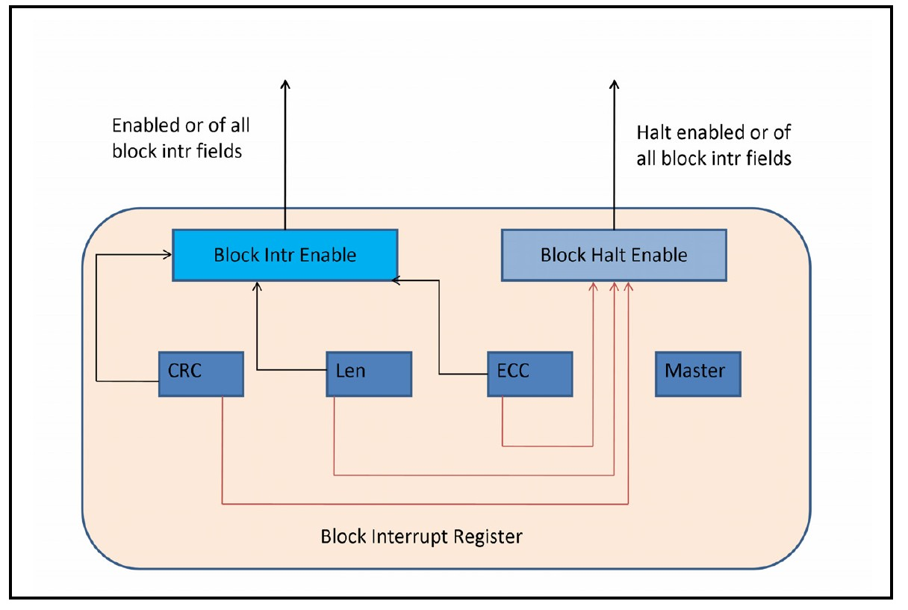

The RDL in `interrupt_hierarchy.rdl` is copied from Section 17.2 of the SystemRDL 2.0 LRM and is meant to show how this "Advanced topic in SystemRDL" looks in compiled form. The former figure below below shows the hierarchy that this RDL will achieve. The latter image shows the block interrupt register.

**Note that both pictures are copied from the [SystemRDL 2.0 LRM](https://www.accellera.org/images/downloads/standards/systemrdl/SystemRDL_2.0_Jan2018.pdf).**

